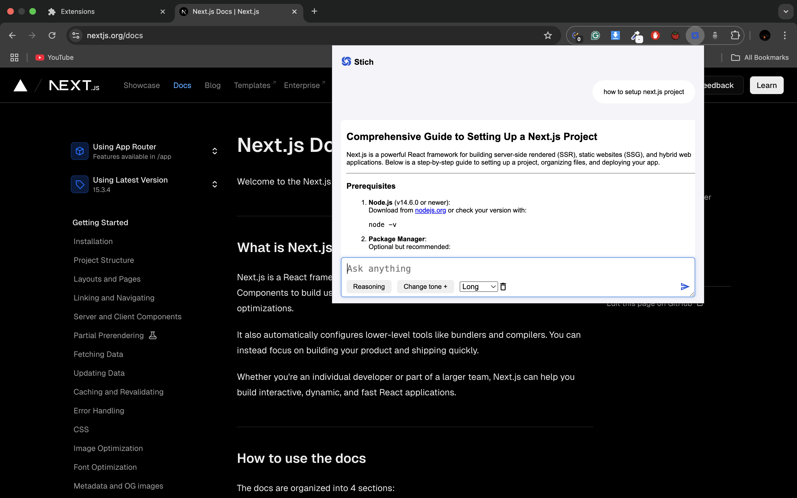
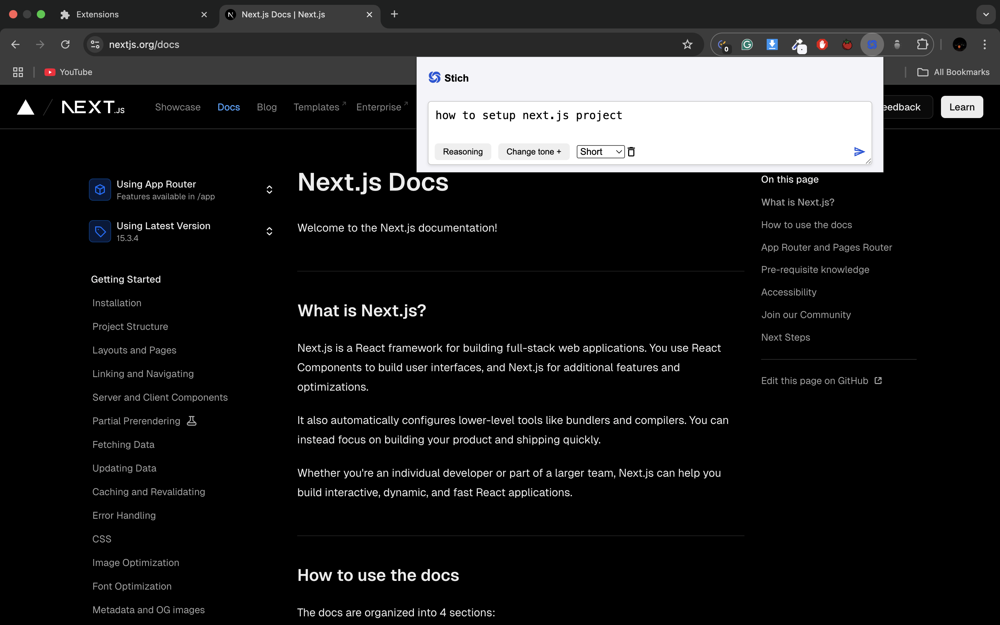
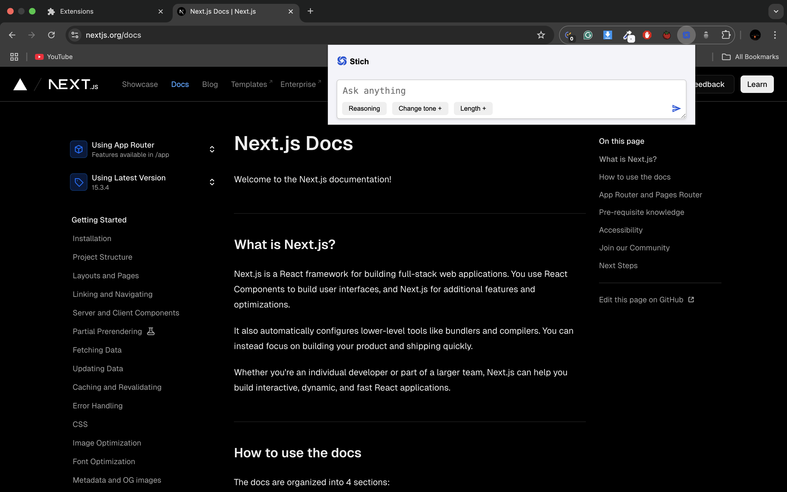

# stich

Stich is a chrome extension, with stich you don't need to switch tabs for using AI you can use this on any site instantly.

## Tech Stack

- [React.js](https://react.dev/)
- [Typescript](https://www.typescriptlang.org/)
- [DeepSeek API](https://api-docs.deepseek.com/)

## Screenshots

# Configuration and running the Project

## Clone the project

<pre>
    git clone `https://github.com/anuprajvarma/cape.git`
</pre>

## Configuration

<pre>
    npm install

Set Envirement Variable

    VITE_HUGGINGFACE_API_KEY=DEEPSEEK_API_KEY

Build project

    npm run build    
</pre>

# Test Project

- open any chrome and go `chrome://extensions/` enable developer mode
- click on `load unpacked` and select build file `dist`
- pin your extension and use
